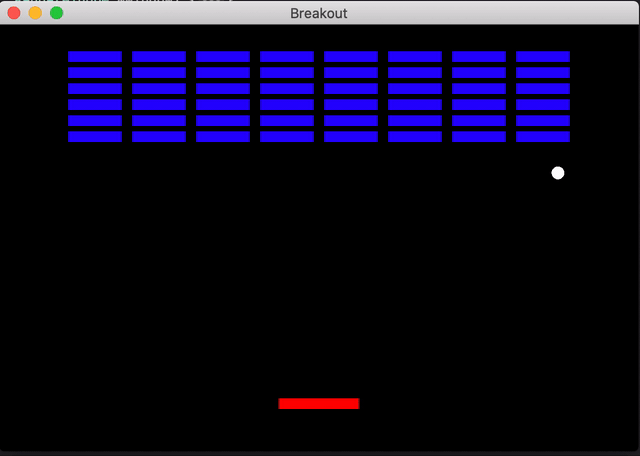

# Breakout
A simple Breakout game made by C++ and SFML framework.

# How to play
 - Use the left arrow key and right arrow key to move the paddle to ricochet the ball.
 - After knock down all the bricks in the game, the player wins!

